# Affinity diagrams / card-sorting

- [First card sort](#first-card-sort)
- [Second card sort](#second-card-sort)
- [Third card sort](#third-card-sort)

## First card sort
Below is our initial card-sort, where we decided to group our interview notes based on the questions that
were asked.
- 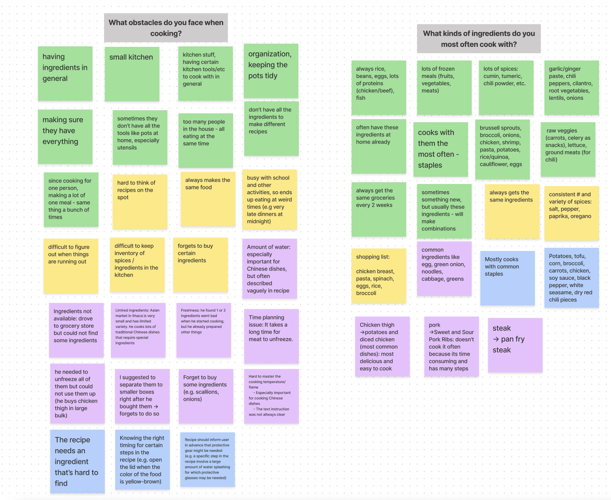
- 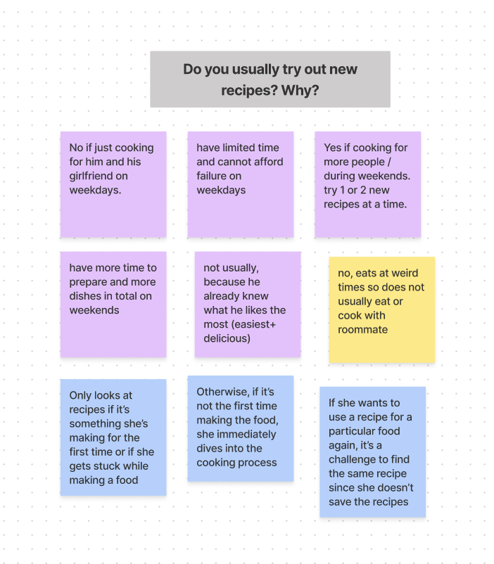
- 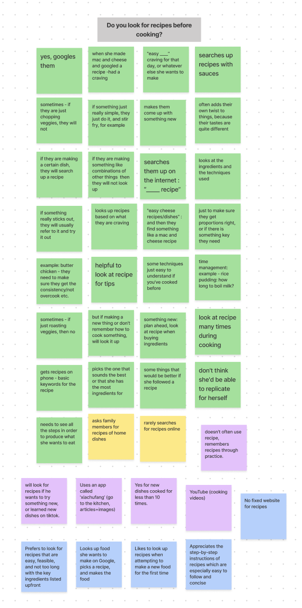
- 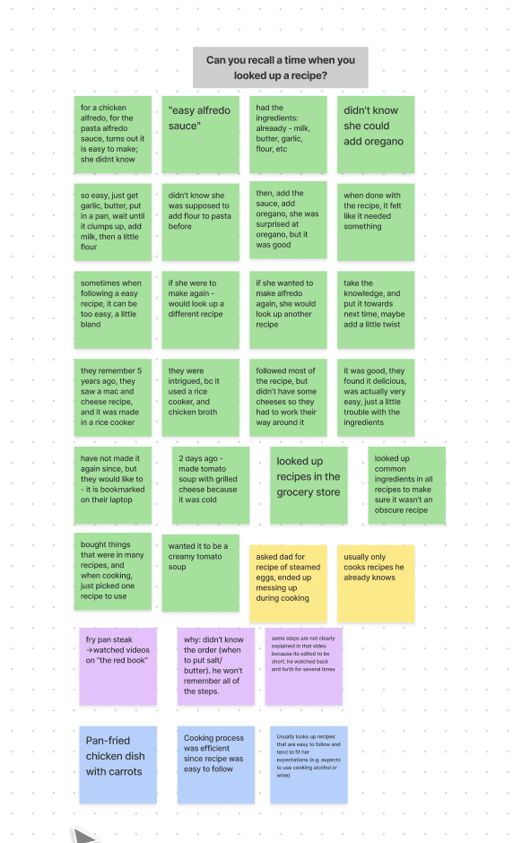
- 
- 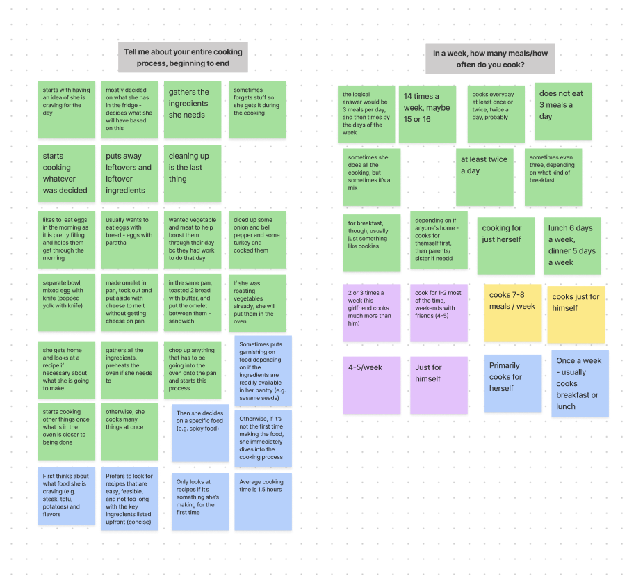
- 

## Second card sort
Below is our second card-sort, where we sorted based on what the interview notes had in common, such as common ways that users looked at recipes, rather than separating them by interview question.
- 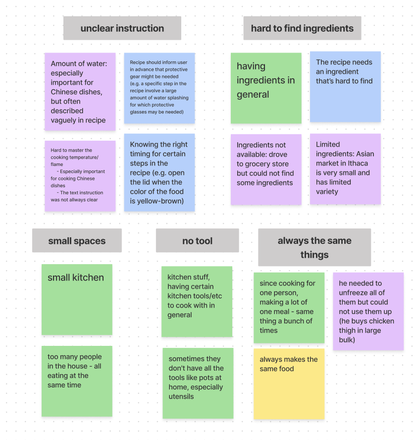
- 
- 
- 
- 
- 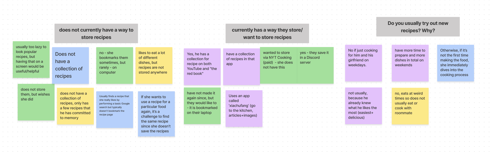
- 
- 
- 
- 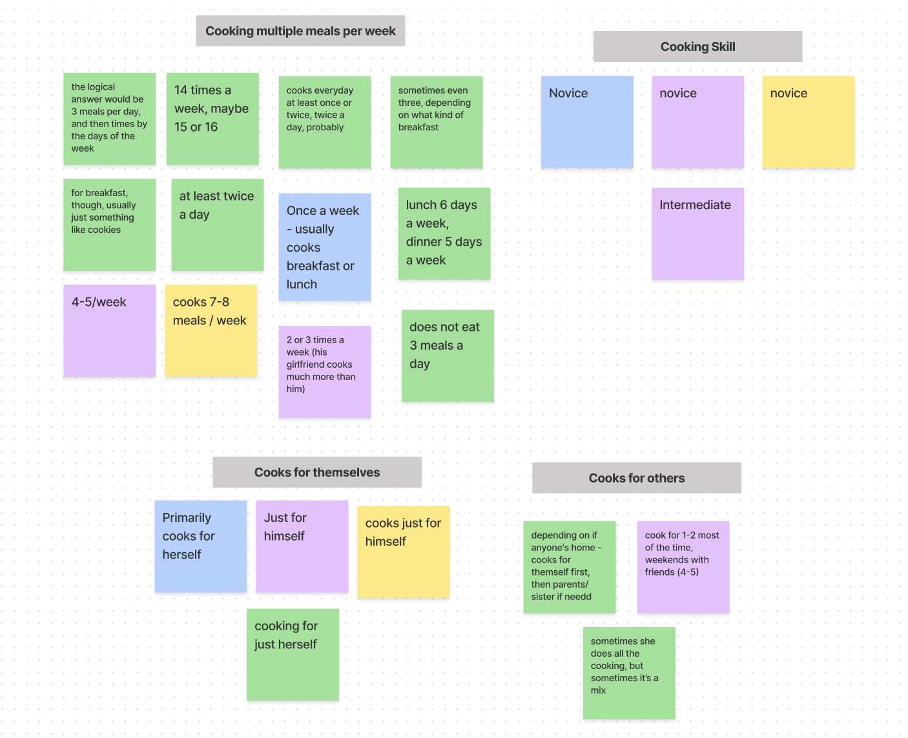
- 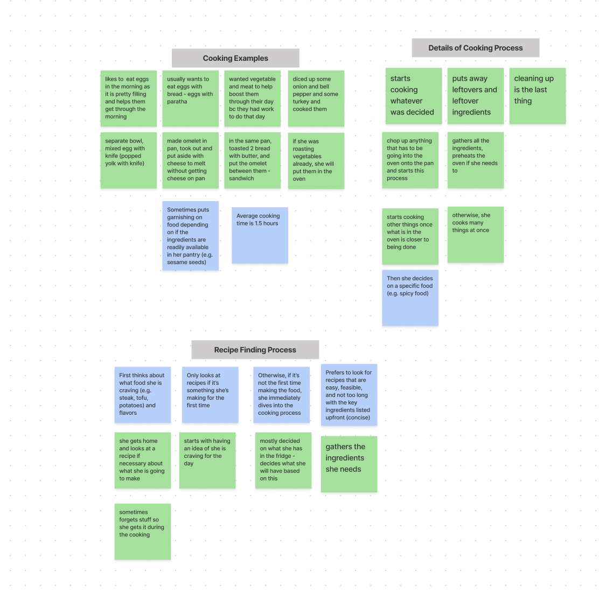
- 

## Third card sort
Below is our third and final card-sort, where we realized that some of the small groups had common content among them, so we grouped them under larger labels that would better showcase the user's thoughts and needs.
- 
- 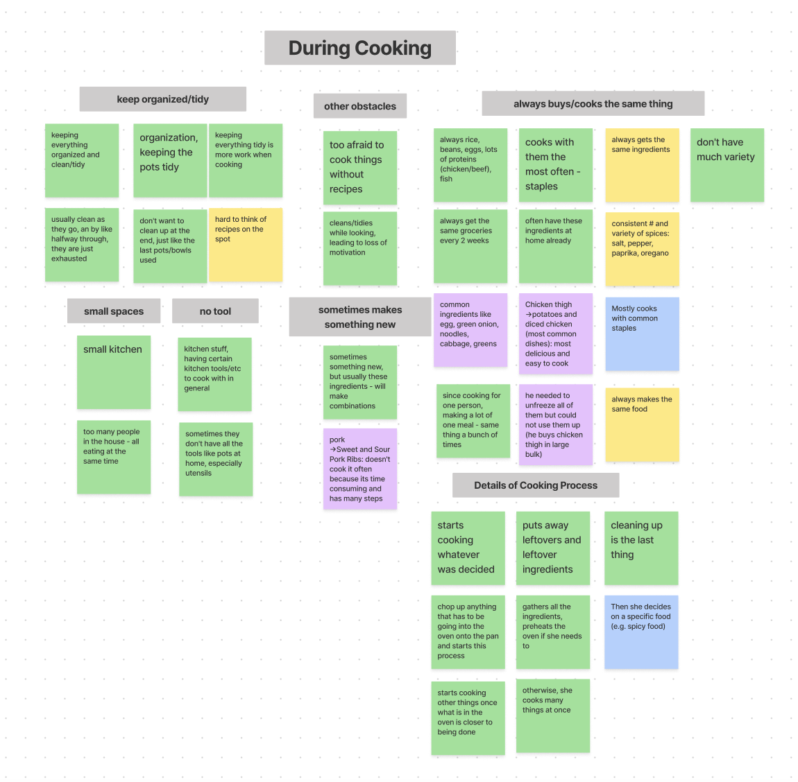
- 
- 
- 
- 
- 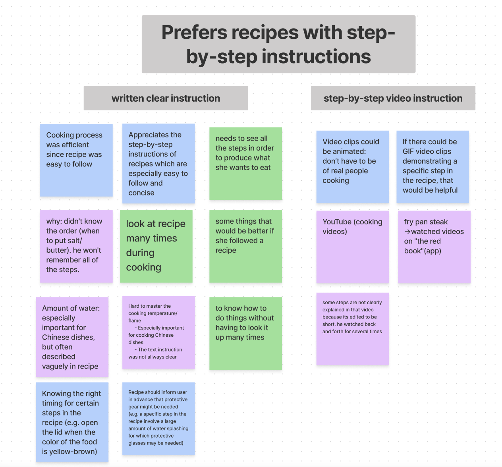
- 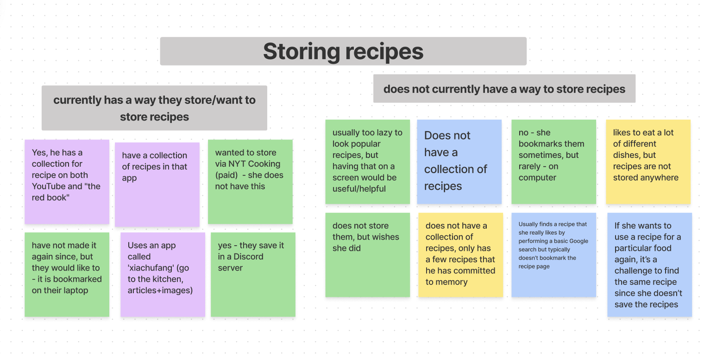
- 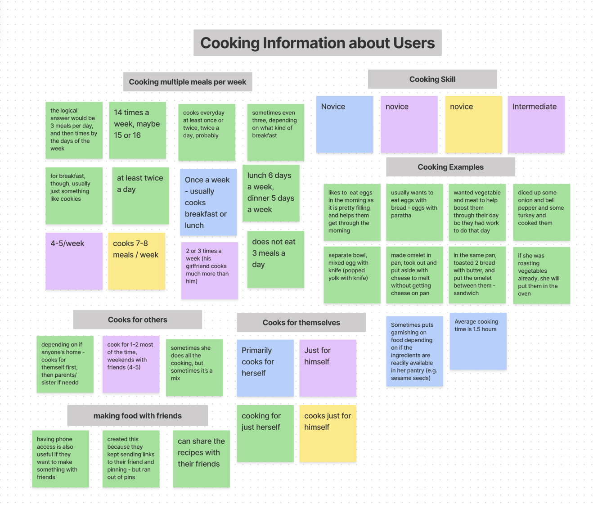
