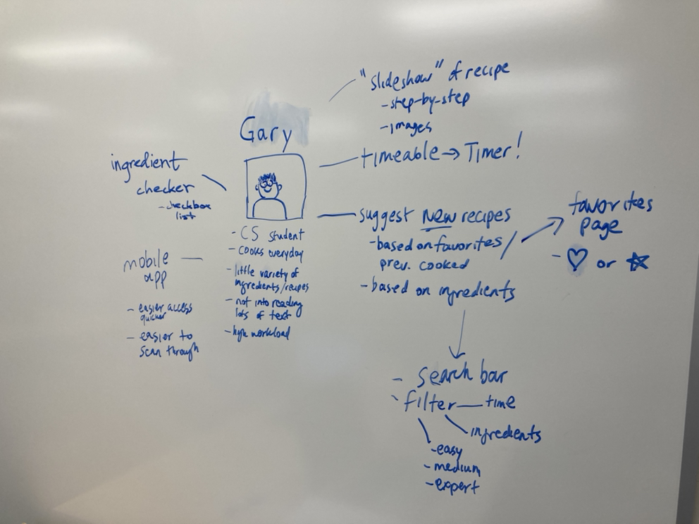
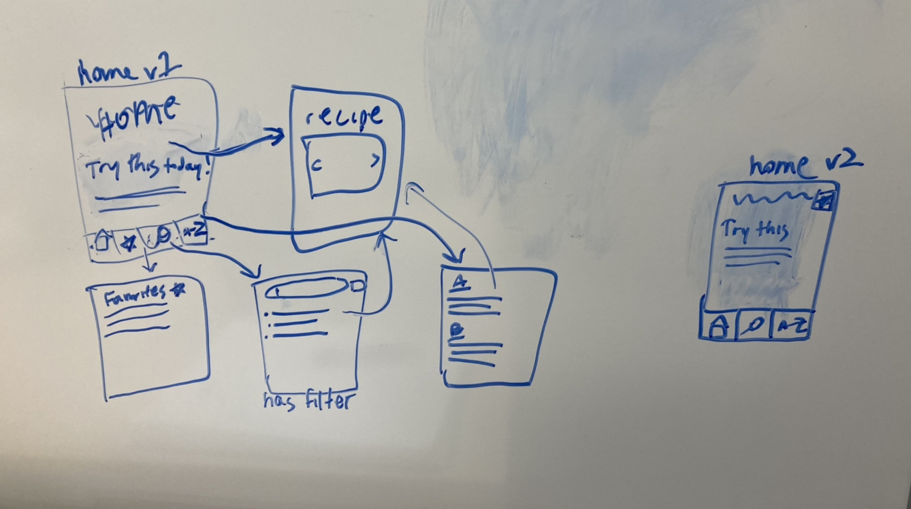
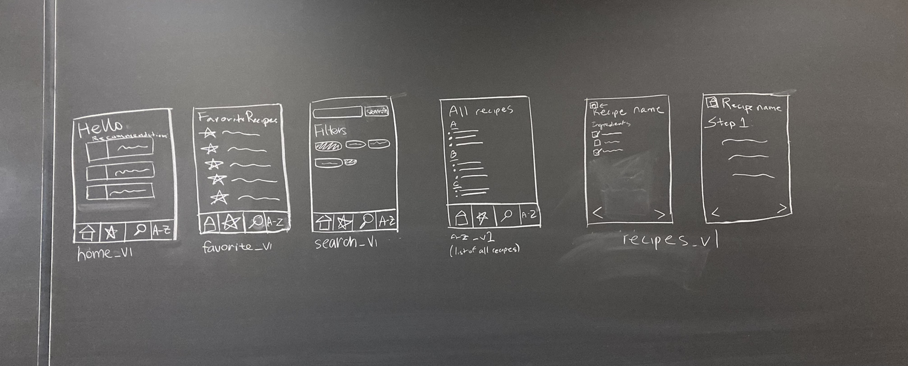
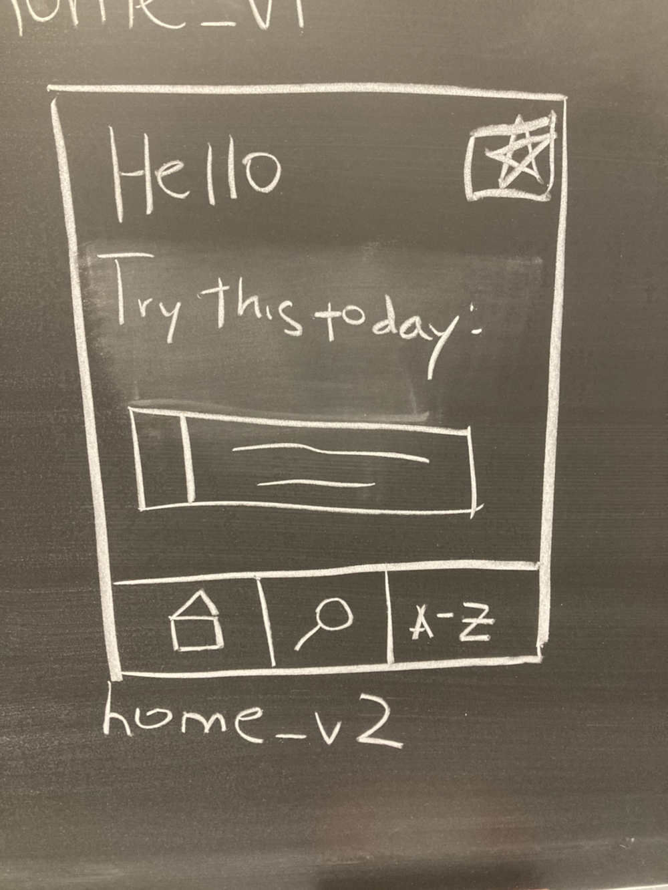
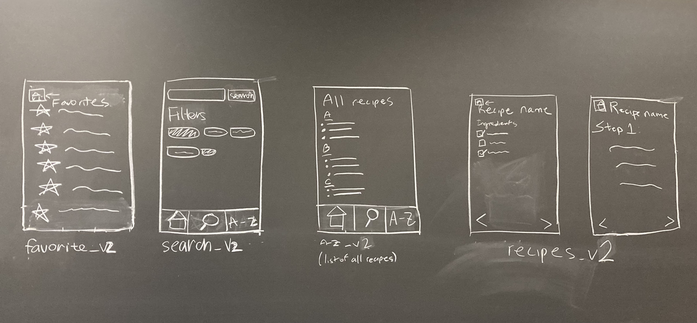
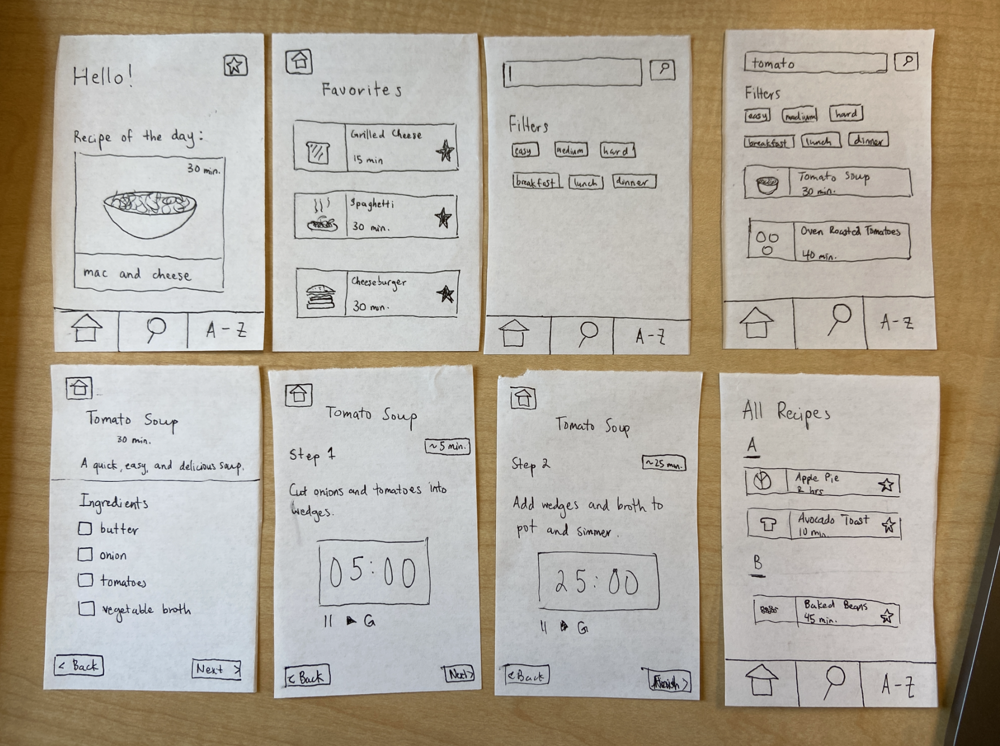
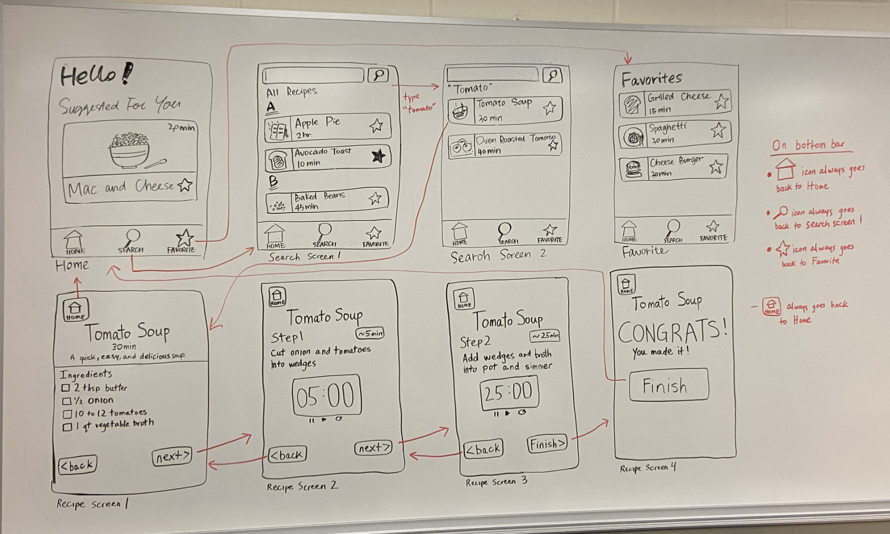

# Milestone 3: Design

### Summary

- Project Group: Gray Guava 
- Team Members: Hanna Kang (hak63), Yulu Cao (yc758), Simrin Kapoor (sk2422), and Jason Zheng (jz449)
- Project Choice: Recipe Finder
- Target users: college students who cook on a fairly consistent basis and would like a more efficient cooking process.
- Key problems: 
    1. Users have trouble following recipes that are too complicated, or don't have step-by-step or clear instructions
    2. Users keep making the same kinds of meals with the same ingredients, and sometimes are not satisfied with the limited variety 

This page includes all of our brainstorming, sketches, paper prototype testing, final sketches/wireframes, and our rationale.

## Brainstorming

Below are what we brainstormed on the whiteboard. We took our persona, Gary, and tried to come up with design ideas based on him. We also tried sketching out some ideas for the screens we want to create.

- Brainstorming ideas for Gary 
- Brainstorming screen ideas 

## Sketches

Below is our first version of sketches for the screens we would like to include in our app. The first version has a bar at the bottom, with icons for other screens: homepage, favorites, search, A-Z. The homepage includes a welcoming message, and also a few randomized recipes that are in the app. The favorites page includes recipes that the user "favorited," and this screen would let them access all of these recipes. The search screen would let users search for recipes based on ingredients/specific recipe names, and also has filters that they can filter by. The A-Z page would have a list of all recipes in the app, alphabetized. The recipe pages are what would display if the user selected a recipe to make. It includes a checklist of ingredients, and provides a very step-by-step process of the recipe. The recipe would also be timeable, so Gary would be able to manage his time better when cooking.

- Screens iteration 1 

Below is our second version of sketches for the screens we would like to include. They are more or less the same, with notable differences being that we have taken the favorites page out of the bottom bar. We decided that the favorites page would probably be better to be accessed at the top corner of the homepage, because if the user didn't have any "favorited" recipes at all, an entire section of the bar at the bottom would have no use. In addition, the favorites page button would be very visible at the top corner, moreso than in the bottom bar. The bottom bar is also simpler with only 3 icons rather than 4.

- Screens iteration 2 - home screen 
- Screens iteration 2 - all other screens 

Below is our third iteration of sketches for the screens. Notable differences include more detailed cards on the homescreen, favorites page, search page, and all recipes page. These cards are of variable size, but all consist of a picture of the dish, name of the dish, and time to cook. Furthermore, we fleshed out the recipe directions page to include a timer component alongside the actual step instructions. This will allow Gary to keep track of how approximately how much time he has to finish a step in the recipe process.

- Screens iteration 3 

## Final Sketches / Wireframes

- Final sketch 

## Rationale

- Screens
    - Home screen
        - The home screen lists a suggested “recipe of the day” for the user based on their favorite recipes.

    - Search screen 
        - The search screen enables the user to find a recipe of their choosing by inputting a specific ingredient into the search bar.

    - Recipe screen
        - The recipe screen is actually a series of screens that guides a user through a specific recipe.
        - At each step in the recipe, the screen will display instructions and also a timer associated with the specific step.

    - Favorites screen 
        - The favorites screen contains the recipes that a user has favorited in the past.
        - This allows for quick access to certain recipes that the user wants to save for future use.

- Key problems
    - users have trouble following recipes that are too complicated (or do not have step-by-step or clear instructions)
    - users keep making the same kinds of meals with the same ingredients and are sometimes not satisfied with the limited variety

- Key problems solutions
    - providing a simple means for users to follow a recipe of their choice step-by-step
    - our design provides a clear, guided process for users to cook recipes that they want to try
    - our design also influences user behavior through the timer feature in that it encourages users to spend the correct amount of time on each step of the recipe
    - our design lists each step of the recipe one at a time, which helps users focus on the current step of the cooking process
        - this enables the user’s mind to be at ease and easily implement a specific recipe. 

In our first scenario of Milestone 2, we described the user as needing to follow a recipe containing tomatoes step-by-step. In our design, the user will follow these steps:

- Open the app
- Go to the “search” screen
- Search for “tomato” in the search bar
- Select a tomato recipe from the listed choices
- Make your way through the guided cooking process until completion

Through this description, our app design effectively communicates with the user and meets their goals:
- our design provides a clear, step-by-step process for the user to efficiently cook a recipe from the ingredient gathering process to plating. 
    - this enables complicated recipes to be broken down into simple steps for the user to follow. 
- also, our design contains a timer feature, so the user spends the correct amount of time at each step in the recipe.
- our design suggests new recipes based on the users’ favorited recipes. 
